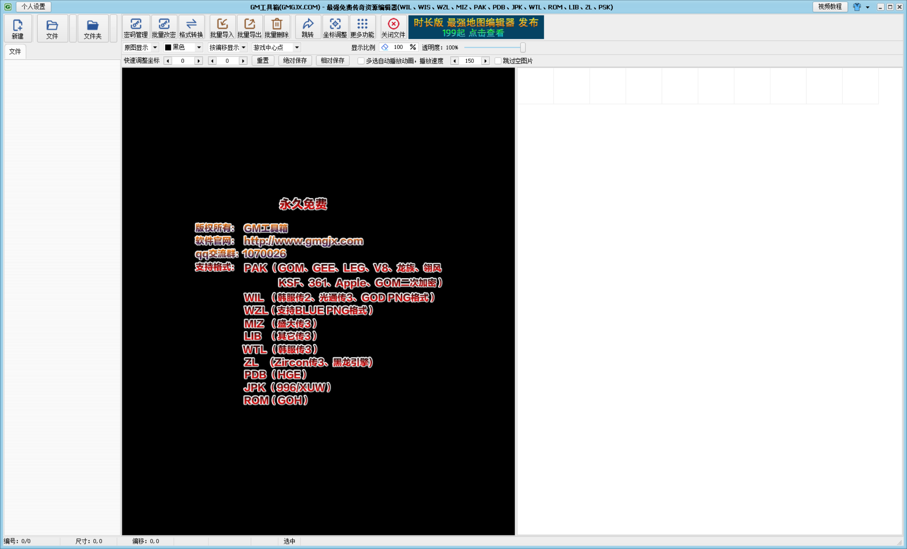

# GM 工具箱资源编辑器 V3.10.0：文件与密码管理链路分析

## 1. 范围与结论

本报告对以下样本做只读静态分析：

- 目标：D:\软件\GM工具\GM工具箱-资源编辑器_V3.8.0 2\GM工具箱-资源编辑器_V3.10.0.exe
- 大小：17,328,640 字节
- SHA-256：9ecafb79034c8471ccac4bd491030c5aa06279ad023471d1701395b4bd0bf585
- EXE 时间戳：2024-03-27 07:15:50 UTC
- FileDescription：GM工具箱 - 传奇资源编辑工具
- FileVersion：3.10.0.120
- ProductName：MIRViewer
- ProgramID：com.embarcadero.MIRViewer
- 版权字段：GM工具箱 - GMGJX.COM

**结论：**

1. 目标是 32 位原生 Windows PE，不是 .NET；版本资源具有 Embarcadero/Delphi 风格标识。
2. PE 主体位于约 16.4 MiB、熵接近 8 的可执行节中，节名随机、导入表极小并依赖 LoadLibraryA/GetProcAddress，符合自定义壳、虚拟化或压缩保护特征。原始磁盘字符串不足以直接恢复业务算法。
3. 外置 PAK.txt 是明文密码映射库，格式为“完整路径|密码”。本次样本中有 2,512 条记录、38 个不同密码，覆盖 2,433 个 .pak 与 79 个 .jpk。
4. Reference\MIRViewer.ini 管理打开、保存、转换路径、文件历史、目录历史，以及保留旧密码、生成新密码、输出无密码等策略开关。
5. GEEPAK3 资源链路可由仓库现有格式恢复代码确认：密码进入受保护的派生过程后，得到索引、全局头、图片头三组密钥，再解密文件结构。目标 EXE 原始派生函数仍未从静态层恢复。
6. License.dat 与 PAK.txt 分属不同链路：前者像授权/激活二进制，后者是明文路径-密码缓存。不能把 License.dat 直接当成 PAK 密钥库。

## 2. 证据等级

- **A：直接证据**：文件元数据、PE 目录、版本资源、同目录文本/INI、仓库已恢复的 GEEPAK3 结构。
- **B：高置信推断**：根据高熵可执行节、随机节名、小导入表、动态 API 解析和保护运行时迹象推断壳/虚拟化。
- **C：未确认**：目标 EXE 的精确派生算法、密码表查找顺序、回写时机、License.dat 是否参与授权校验、JPK 具体读写格式。

## 3. PE 静态指纹

### 3.1 运行时与导入

| 项目 | 结果 |
|---|---|
| 架构 | x86，Machine 0x14c |
| CLR | 无 COM Descriptor，排除普通 .NET |
| 子系统 | Windows GUI |
| 入口点 | RVA 0x1DBE7B1 |
| TLS | 有 TLS 目录，但 AddressOfCallBacks=0；不能据此断言存在 TLS 回调 |
| 资源 | 9 个资源条目，含 MAINICON、VS_VERSION_INFO、清单 |
| 导出线索 | TMethodImplementationIntercept、__dbk_fcall_wrapper、dbkFCallWrapperAddr |

代表性导入：

- 文件、目录和 UI：SHBrowseForFolderW、MakeSureDirectoryPathExists、GetModuleFileNameW、ChooseColorW、CopyImage、DocumentPropertiesW
- 动态解析：LoadLibraryA、GetModuleHandleA、GetProcAddress
- 注册表和网络：RegSetValueExW、htonl、gethostbyaddr
- 其他：timeGetTime、GetFileVersionInfoSizeW、OpenGL/GDI 入口

没有直接导入 CreateFile、ReadFile、WriteFile、CryptoAPI、BCrypt 等常见入口。这不能证明程序不读文件或不加密；更可能表示这些入口在保护层中动态解析、自实现或被编译器/运行库间接封装。

### 3.2 壳/保护迹象

- 17 个节，只有随机命名节和 .rsrc 具有明显原始数据布局；主体节的 raw size/offset 不像普通未加壳 Delphi 输出。
- .X5w 为可执行节，原始数据约 16.4 MiB，64 KiB 窗口熵约 7.96，整体接近 8。
- 导入表小，存在 LoadLibraryA/GetProcAddress。
- 原始 ASCII/UTF-16 字符串中的 PAK、AES、MD5、SHA 等命中大多落在高熵数据中，不能作为算法证据。
- 未发现可靠的 VMProtect、Themida 或 UPX 标识串；因此只写“保护/高熵布局推断”，不指定具体产品。

## 4. 密码管理链路

### 4.1 PAK.txt：明文路径-密码库

文件：

~~~text
D:\软件\GM工具\GM工具箱-资源编辑器_V3.8.0 2\PAK.txt
~~~

静态统计：

| 项目 | 值 |
|---|---|
| 大小 | 171,152 字节 |
| SHA-256 | e27d22d6613693d3667fc78bfa2d63d7eae4e34bf452439b65fbd294322c4d2e |
| 有效记录 | 2,512 |
| 不同密码 | 38 |
| .pak | 2,433 |
| .jpk | 79 |
| 重复完整路径 | 未发现 |

每行结构：

~~~text
资源文件完整路径|明文密码
~~~

样本前几行可见类似：

~~~text
C:\...\Tiles66.pak|123
H:\...\GJN.Pak|GEEM2
H:\...\jineng1.Pak|V8M2
~~~

这直接证明：至少在该样本配套目录中，密码以明文方式独立保存，不是写在 PAK 文件内部的密钥块中。

高频密码统计也说明它更像长期积累的“路径到密码缓存”，而不是每次临时生成的会话令牌：

- qq235647：767 条
- Qq1004290：372 条
- GEEM2：348 条
- V8M2：80 条
- 996M2.COM：79 条
- 111：70 条
- 123：42 条

### 4.2 推断的密码查找流程

~~~text
用户选择/双击 PAK 或 JPK
  -> 规范化文件路径
  -> 读取 PAK.txt
  -> 找到对应路径的明文密码
  -> 将密码送入 PAK 解密/校验链
  -> 成功后进入预览、导出、转换或保存
~~~

静态样本不能确认以下细节：

- 是只按完整路径查找，还是同时按文件名兜底；
- 密码失败后是否自动弹窗；
- 手动输入成功后是否追加/覆盖 PAK.txt；
- 文件编码具体是系统 ANSI、GBK 还是混合历史编码。

仓库当前重建实现选择了“完整路径优先、唯一同名兜底、成功后更新 FilePassword.txt”的保守行为，但这是重建策略，不应冒充原 EXE 的逐行源码。

### 4.3 INI：路径、历史与密码策略

文件：Reference\MIRViewer.ini

- 大小：3,505 字节
- SHA-256：2c174aa321ad904866d2c0147e00a934219c10e66c9dfaf644c764f06d9c402c

关键字段：

~~~ini
OpenFilePath=...
OpenFolderPath=...
SaveFolderPath=...
TransformPath=...

TransformSavePassword=1
TransformNewPassword=1
TransformFileNoPassword=0
NewFileNoPassword=0
MargeFileNoPassword=0

FileLockHint=1
FileReadOnlyHint=1

[FileHistory]
...
[FolderHistory]
...
~~~

含义可分为：

- 路径状态：打开文件夹、保存文件夹、转换目录；
- 文件/目录历史：绝对路径加 =1 标志；
- 转换策略：是否保存旧密码、是否生成新密码、是否移除密码；
- 新建/合并策略：是否创建无密码文件；
- 交互提示：文件锁定、只读提示。

这些字段是行为策略，不是密钥本身。

## 5. GEEPAK3 文件与密码到密钥链路

仓库中已有对 GEEPAK3 的格式恢复：

~~~text
0x000  8 字节签名：07 47 45 45 50 41 4B 33
0x008  2 字节保留字段
0x00A  256 字节加密全局头
0x10A  UInt32 索引表
后续   图片块头和像素载荷
~~~

解密后的全局头字段：

- +0x2A：HeaderSize，固定 266
- +0x2E：SlotCount
- +0x32：Version，固定 2
- +0x36：IndexOffset，固定 266

索引解密公式：

~~~text
offset[i] = encrypted[i] XOR NOT(indexKey[i mod 64]) XOR i
~~~

图片块头固定 16 字节，包含图片类型、标志、宽高、X/Y 偏移和压缩长度；载荷可为 zlib 或原始像素数据。

抽象密码链：

~~~text
明文密码
  -> 目标 EXE 内部受保护的派生入口
  -> indexKey       256 字节
  -> globalHeaderKey 256 字节
  -> imageHeaderKey 1024 字节
  -> 解密全局头、索引、图片块头
  -> 校验全局头/范围/尺寸/zlib
  -> 浏览、导出、编辑、写回
~~~

三组密钥长度来自仓库现有桥接模型和格式验证；目标 EXE 的原始派生算法、常量、编码和是否绑定许可证，当前都标为未确认。

## 6. 文件管理链路

~~~text
启动编辑器
  -> 读取 MIRViewer.ini 的路径与历史
  -> 用户选择 PAK/JPK/WZL 等资源
  -> 根据扩展名/签名识别格式
  -> 从 PAK.txt 取得明文密码（若有）
  -> 派生/取得密钥并校验头、索引和块
  -> UI 浏览/预览/导出
  -> 转换、新建、合并、另存或覆盖保存
  -> 按 INI 的旧密码/新密码/无密码策略输出
  -> 更新文件历史、目录历史和路径状态
~~~

边界：

- GEEPAK3：签名为 07 47 45 45 50 41 4B 33，索引和图片块头受派生密钥保护。
- WZL/WZX：数据文件与同名索引文件配对，通常走独立的块和偏移链。
- JPK：既出现在 PAK.txt 中，工具主界面也明确标注支持 JPK（996/XUW）；但本次没有足够样本确认其完整格式，不能自动等同 GEEPAK3。

## 7. License.dat 与网络线索

Reference\License.dat：

- 大小：26,449 字节
- SHA-256：5f50d6d765bfe6e494417d0e4ac7b914444c7a2543a97314cbfbb338692f8d92
- 头部标识：GMGJX.COM
- 可见 URL：https://mon.gmgjx.com/、https://mapedit.gmgjx.com
- 主体为高熵二进制，夹有 GIF 数据片段

更合理的解释是授权/激活或产品附带数据。静态证据不足以确认它参与 PAK 密码派生；不要把它和 PAK.txt 合并为同一密码系统。

## 8. UI 截图直接证据

证据图片：

截图中的窗口标题为“GM工具箱(GMGJX.COM) - 最强免费传奇资源编辑器”，可直接观察到以下功能入口：

- 文件链路：新建、文件、文件夹、关闭文件。
- 密码链路：密码管理、批量改密。
- 格式与数据处理：格式转换、批量导入、批量导出、批量删除。
- 资源编辑：跳转、坐标调整、绝对保存、相对保存、动画播放速度和跳过空图片。

这组 UI 证据进一步说明：

1. “密码管理”和“批量改密”是独立工具栏命令，密码管理并非资源预览控件内部的隐式功能。
2. “格式转换”与“批量改密”也是不同命令，因此格式识别、数据转换、密码重新生成或替换应当是可组合但边界分离的流程。
3. 文件和文件夹分别有打开入口，和 MIRViewer.ini 中 OpenFilePath、OpenFolderPath、FileHistory、FolderHistory 的状态结构相互印证。
4. “绝对保存”和“相对保存”直接表明坐标元数据至少存在两种保存语义；其精确写回规则仍需样本差分确认。

### 8.1 界面宣称的格式矩阵

截图中央欢迎页显示的支持范围如下：

| 格式 | 截图中的变体/说明 |
|---|---|
| PAK | GOM、GEE、LEG、V8、龙族、翎风、KSF、361、Apple、GOM 二次加密 |
| WIL | 韩服传 2、光通传 3、GOD PNG 格式 |
| WZL | 支持 BLUE PNG 格式 |
| MIZ | 盛大传 3 |
| LIB | 其它传 3 |
| WTL | 韩服传 3 |
| ZL | Zircon 传 3、黑龙引擎 |
| PDB | HGE |
| JPK | 996/XUW |
| ROM | GoH |

窗口标题还列出 WIS、PSK；中央欢迎页没有给出其变体说明。

### 8.2 证据边界

- 截图能证明该版本 UI **宣称支持**上述格式和变体，也能证明相应命令在界面中存在。
- 截图不能证明所有格式共享同一个文件头、密码算法、压缩算法或写回流程。
- PAK 明确包含多个引擎变体和“GOM 二次加密”，因此扩展名 .pak 只能作为候选类型，实际打开必须继续检查签名、头字段或变体探测结果。
- JPK（996/XUW）现在有 UI 和 PAK.txt 两类旁证，但内部索引、密码和图片块格式仍需 JPK 样本验证。

## 9. 与仓库现有实现的对照

仓库通过 CodeGraph 确认的主链路：

- MainController.OpenArchive -> OpenArchiveByFormat -> OpenGeePak3
- PakPasswordService.ResolvePassword / SavePassword
- GeePakArchiveService.Open / Save
- PakBridgeKeyDerivationService.TryDerive

| 目标侧观察 | 仓库现有实现 | 说明 |
|---|---|---|
| 外置明文密码表 | FilePassword.txt，完整路径\|密码 | 数据语义一致，文件名与搜索范围是重建层差异 |
| 已知密码优先 | 配置密码 -> 内置默认密码 -> 手动输入 | 目标顺序未动态确认 |
| GEEPAK3 头/索引/块 | 已实现签名、XOR 索引、头/范围/zlib 校验 | 与格式恢复记录一致 |
| 任意密码 | 本机离线桥接返回 256/256/1024 字节密钥 | 保留了原始派生算法未恢复的边界 |
| 保存 | 同目录临时文件完成后替换 | 是重建实现的安全策略，不能直接宣称原程序相同 |
| WZL/WZX | 分开读取，M2Zip 变体只读 | 目标工具对所有变体的写回能力未确认 |

## 10. 已确认、未确认与下一步

### 已确认

- 32 位原生 Embarcadero/Delphi 风格 GUI 工具。
- PAK.txt 是明文路径-密码库，2,512 条记录、38 个密码。
- MIRViewer.ini 管理路径、历史和密码/转换策略开关。
- License.dat 是独立的高熵授权/产品数据文件。
- GEEPAK3 头布局、索引公式和三组密钥角色已在仓库中形成可审阅实现。
- UI 明确提供密码管理、批量改密、格式转换及批量导入、导出、删除入口。
- UI 宣称支持多种 PAK 引擎变体以及 WIL、WZL、MIZ、LIB、WTL、ZL、PDB、JPK、ROM 等格式。

### 未确认

- PAK.txt 的真实查找顺序、编码和成功后的回写时机。
- 目标 EXE 的精确密码派生算法、是否使用机器/许可证绑定。
- JPK 的完整读写格式。
- License.dat 是否参与在线授权、离线激活或仅作资源容器。
- 转换/合并时旧密码、新密码和无密码选项的具体文件输出。

### 合规的后续验证

如需继续，建议在隔离虚拟机、授权样本和本地测试资源中做动态观测：

- 只记录打开/写入的文件路径、INI/PAK.txt 读写、创建的临时文件；
- 记录密码派生函数的输入输出长度和错误分支，不提取第三方账户凭据；
- 对比“已知密码、错误密码、手动新密码、无密码输出”四种受控样本；
- 不绕过在线服务、许可证或第三方账户保护。

## 11. 分析限制

- 本次未运行目标 EXE，未做 x64dbg/Frida/Procmon 动态追踪。
- 未修改、解包、打补丁或写入目标 EXE 目录。
- 壳/保护导致静态字符串不可靠。
- 报告区分目标样本证据、同目录旁路文件和仓库重建代码，不把重建代码冒充原始 Delphi 源码。
- 截图中的格式清单属于产品界面声明，不等同于已完成逐格式二进制验证。

## 12. 证据清单

- 目标 EXE：9ecafb79034c8471ccac4bd491030c5aa06279ad023471d1701395b4bd0bf585
- PAK.txt：e27d22d6613693d3667fc78bfa2d63d7eae4e34bf452439b65fbd294322c4d2e
- Reference\MIRViewer.ini：2c174aa321ad904866d2c0147e00a934219c10e66c9dfaf644c764f06d9c402c
- Reference\License.dat：5f50d6d765bfe6e494417d0e4ac7b914444c7a2543a97314cbfbb338692f8d92
- Reference\Hum.pak：387c80770c030165390c64d6cd0b6570ff900824a09d961cd708ea3c7a6cba83
- Reference\Weapon.pak：2bd6a89d434cf98e70abee7504bea31cd46211e7e64ae87c22df96429de8d8c6
- UI 截图：analysis\evidence\GM工具箱_V3.10.0_主界面.png
- UI 截图 SHA-256：d59a998fcc037880cf5c32f41bf19b048d17b0637c3e6decf5890ef38ee3d308
